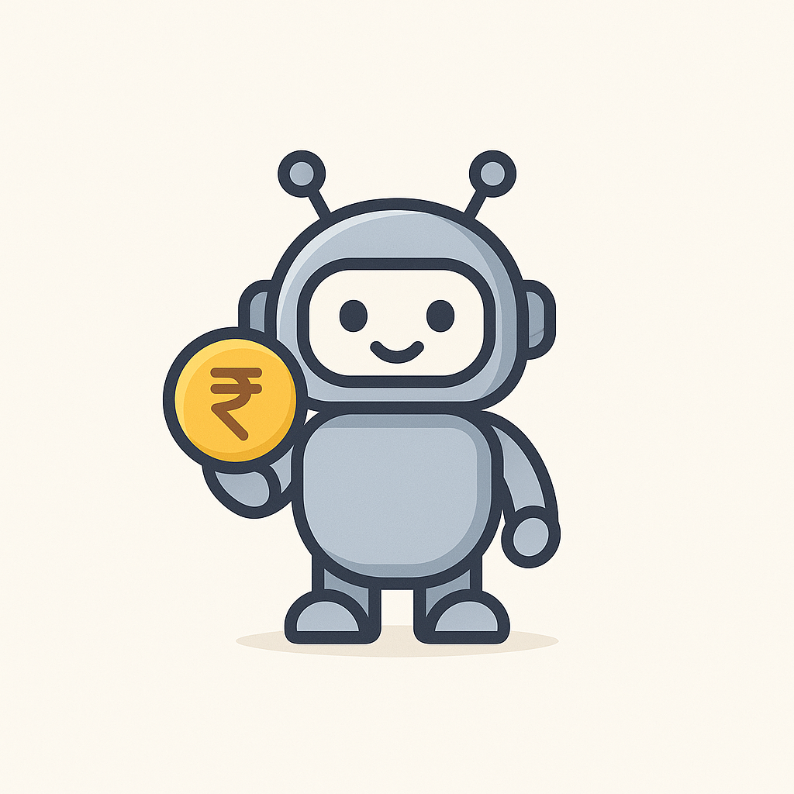

# MyBudgetPal

  

---

## About

**MyBudgetPal** is a personal finance management Android app that helps you track your expenses and manage your budget with ease. Designed for everyday use, it provides insights into your spending habits and helps you stay on top of your finances.

---

## Usage

- Add your daily expenses with categorized entries.
- View spending trends over time.
- Set and manage budgets for different categories.
- Get quick financial summaries and reports.

---

## Tech Stack

- **Kotlin** – Android app development  
- **Android Jetpack** – Architecture components and UI tools  
- **Firebase** – Backend services for real-time database and authentication  
- **Material Design** – Modern UI components for better UX  

---

## Why I Started This Project

I built **MyBudgetPal** to deepen my understanding of Kotlin and Android development. This project also serves as my personal budgeting tool, helping me manage my expenses while practicing app development and backend integration.

---

